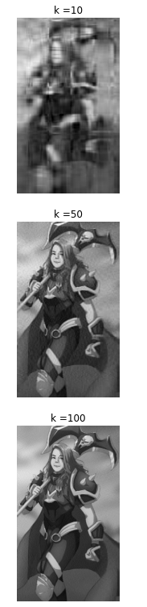

# Compressao De Imagens

Código feito em python, responsável por realizar a compresão de imagens utilizando o método SVD (Decomposição em Valores Singulares). Dada uma imagem colorida, depois de transformála em uma figura em tons de cinza, é possível representá-la por umamatriz A, onde cada elemento desta corresponde a um píxel na imagem. O fato dessas imagens serem mantidas e transmitidas na forma de matrizes de dimensões grandes requerem muito espaço de armazenamento. Com intuito de otimizar esse processo aborda-se neste trabalho a redução no espaço de armazenamento de imagens utilizando a SVD de uma matriz.

